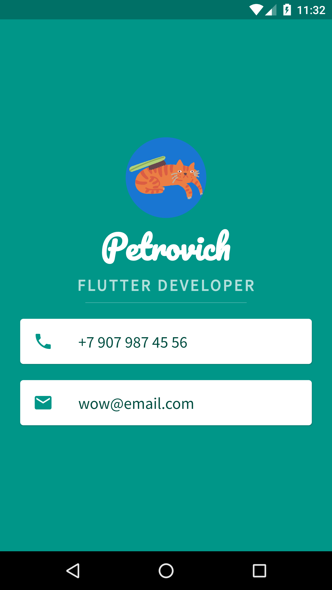
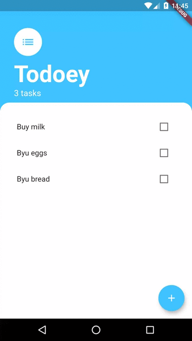

# flutter-practice
Base repo for flutter practice. 
This repository contains training projects completed during the course
[**The Complete 2020 Flutter Development Bootcamp with Dart**](https://www.udemy.com/course/flutter-bootcamp-with-dart/).

# Table of Contents  
1. [Bitcoin ticker](#bTicker)
1. [BMI calculator](#bmiCalculator)
1. [Decision app](#decision)
1. [Dicee](#dicee)
1. [Flash chat](#flash)
1. [Mi card](#mi)
1. [Todo](#todo)

## [Bitcoin ticker](#toc) 
A simple app with small functionality for getting cryptocurrency course in many currencies pairs

Source code: [/bitcoin_ticker](/bitcoin_ticker/)

Example UI:

 

## [BMI calculator](#toc)  
Simple BMI calculator

Source code: [/bmi_calculator](/bmi_calculator/)

Example UI:

## [Decision app](#toc) 
Simple decision making app

Source code: [/decision_making_app](/decision_making_app/)

Example UI:

## [Dicee](#toc) 
The dice simple app

Source code: [/dicee](/dicee/)

Example UI:

## [Flash chat](#toc) 
Chat based on firebase auth and cloud storage

Source code: [/flash_chat](/flash_chat/)

Example UI:

## [Mi card](#toc) 

Simple app like a visiting card

Source code: [/mi_card](/mi_card/)

Example UI:

## [Todo](#toc) 

Simple todo app

Source code: [/todoey](/todoey/)

Example UI:

