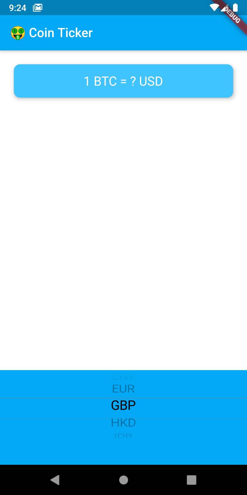
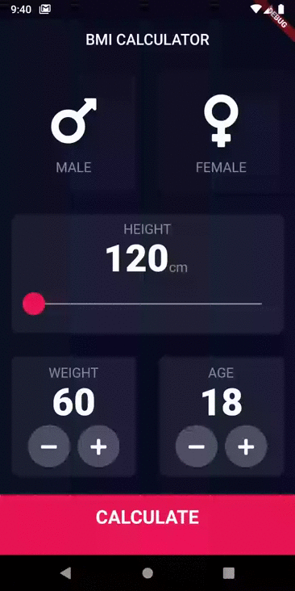
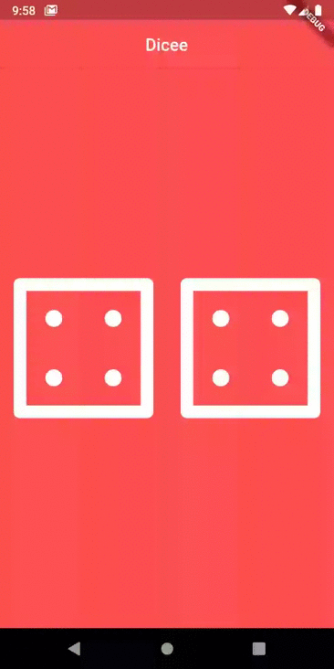
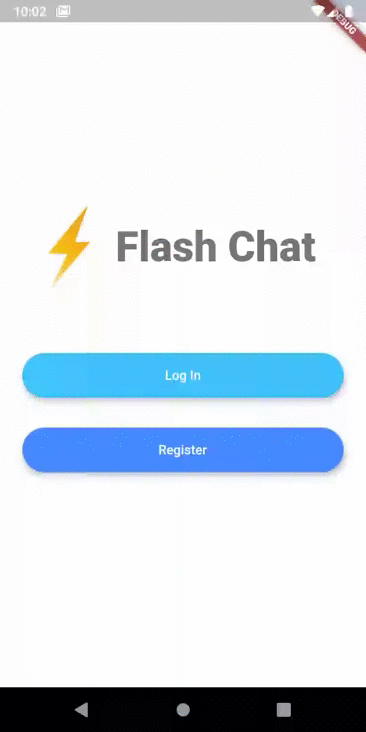

# flutter-practice
Base repo for flutter practice. 
This repository contains training projects completed during the course
[**The Complete 2020 Flutter Development Bootcamp with Dart**](https://www.udemy.com/course/flutter-bootcamp-with-dart/).

# Table of Contents  
1. [Bitcoin ticker](#bTicker)
1. [BMI calculator](#bmiCalculator)
1. [Decision app](#decision)
1. [Dicee](#dicee)
1. [Flash chat](#flash)

## [Bitcoin ticker](#toc) 
A simple app with small functionality for getting cryptocurrency course in many currencies pairs

Example UI:

 

## [BMI calculator](#toc)  
Simple BMI calculator

Example UI:

## [Decision app](#toc) 
Simple decision making app

Example UI:

## [Dicee](#toc) 
The dice simple app

Example UI:

## [Flash chat](#toc) 
Chat based on firebase auth and cloud storage

Example UI:

